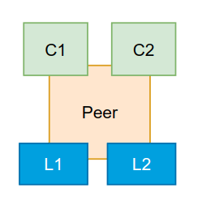
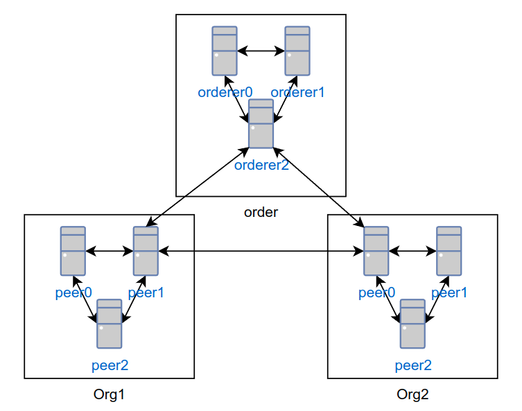
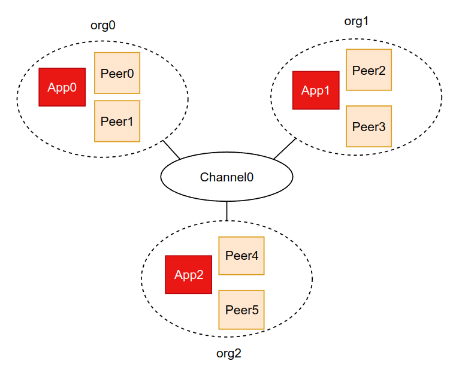
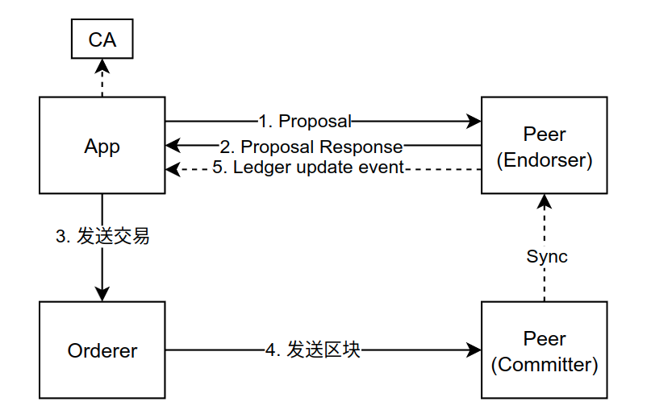
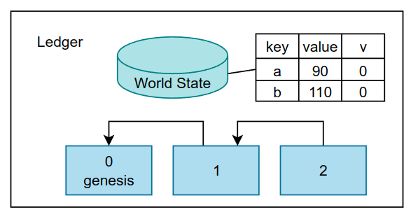
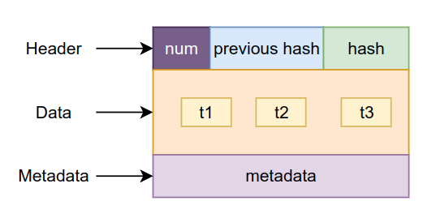
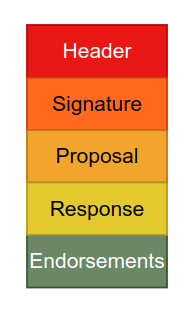

# Hyperledger Fabric

* 区块链(分布式账本)
* 联盟链(多中心化)
* 智能合约

  

区块链是由众多参与者(节点)组成的P2P 网络, 每个节点都拥有一个账本的拷贝, 每当有新的交易进来，所有节点的账本都会更新，并且最终保持一致。

## Model
* **Chaincode**: 链码就是智能合约(**Smart Contract**), 一旦某个事件触发合约中的条款, 代码即自动执行。把约定通过代码的形式，录入区块链中，一旦触发约定时的条件，就会有程序来自动执行，这就是智能合约, 就是业务逻辑  
* **Consensus**: 各个参与者交易信息同步的过程. 共识确保所以参与者都会将同样的信息按同样的顺序更新  
* **Security & Membership Services**: 提供成员身份认证服务, 区块链网络内所有交易都可以被追溯  
* **Ledger**: 账本是一个有序、防篡改的结构, 是一个个存储着不可修改的数据的区块组成的链表, 每个频道维护一个帐单. 参与者调用链码实现状态转变  
* **Privacy**: 通过频道来隔离帐单, 只有在频道中的参与者才能获取频道内的帐单  
* **Consortium Blockchains**: Hyperledger Fabric属于联盟链: 多个组织通过授权接入，由某些节点参与共识过程  

### 节点示例  
  
  

### 组织和节点  
  

### 交易过程  
    

---

## Ledger

### World State  

world state用于提供简单高效的存储和查询帐单状态, 默认数据库是LevelDB  

  

### CouchDB  

```json
{
    "ID":"a",
    "data":90
}
```

```json
{
  "_id": "a",
  "_rev": "2-ff3e653e719e630d7fa77aed8036fa39",
  "~version": "CgMBBwA=",
  "_attachments": {
    "valueBytes": {
      "content_type": "application/octet-stream",
      "revpos": 2,
      "digest": "md5-hhOYXsSeuPdXrmQ56Hm7Kg==",
      "length": 2,
      "stub": true
    }
  }
}
```

### 区块结构 

  

* **Header**: hash由**Data**计算得出  
* **Data**: 列表, 由多个排序过的交易组成  
* **Metadata**: 包含验证过此区块的证书和签名, 不加入hash值的运算  

### 交易结构    

  

* **Header**: 基础元数据, 如相关链码的名称及其版本  
* **Signature**:  加密的签名, 用于检查是否篡改, 由应用的私钥生成  
* **Proposal**: 编码后的输入参数(应用调用智能合约), 和当前world state组成新的world state  
* **Response**: 智能合约的输出, 校验成功后用于更新world state  
* **Endorsements**: 一个列表, 由来自各组织对签名过的交易响应组成, 列表中每个元素都满足背书策略  


## 代码示例  

### Chaincode  
```go
// 查询
func (t *ABstore) Query(ctx contractapi.TransactionContextInterface, A string) (string, error) {
	var err error
	// Get the state from the ledger
	Avalbytes, err := ctx.GetStub().GetState(A)
	if err != nil {
		jsonResp := "{\"Error\":\"Failed to get state for " + A + "\"}"
		return "", errors.New(jsonResp)
	}

	if Avalbytes == nil {
		jsonResp := "{\"Error\":\"Nil amount for " + A + "\"}"
		return "", errors.New(jsonResp)
	}

	jsonResp := "{\"Name\":\"" + A + "\",\"Amount\":\"" + string(Avalbytes) + "\"}"
	fmt.Printf("Query Response:%s\n", jsonResp)
	return string(Avalbytes), nil
}
// 转帐
func (t *ABstore) Invoke(ctx contractapi.TransactionContextInterface, A, B string, X int) error {
	var err error
	var Aval int
	var Bval int
	// Get the state from the ledger
	Avalbytes, err := ctx.GetStub().GetState(A)
	if err != nil {
		return fmt.Errorf("Failed to get state")
	}
	if Avalbytes == nil {
		return fmt.Errorf("Entity not found")
	}
	Aval, _ = strconv.Atoi(string(Avalbytes))

	Bvalbytes, err := ctx.GetStub().GetState(B)
	if err != nil {
		return fmt.Errorf("Failed to get state")
	}
	if Bvalbytes == nil {
		return fmt.Errorf("Entity not found")
	}
	Bval, _ = strconv.Atoi(string(Bvalbytes))

	// Perform the execution
	Aval = Aval - X
	Bval = Bval + X
	fmt.Printf("Aval = %d, Bval = %d\n", Aval, Bval)

	// Write the state back to the ledger
	err = ctx.GetStub().PutState(A, []byte(strconv.Itoa(Aval)))
	if err != nil {
		return err
	}

	err = ctx.GetStub().PutState(B, []byte(strconv.Itoa(Bval)))
	if err != nil {
		return err
	}

	return nil
}
```

### App  
```go
// 组织、账户、节点信息
sdk, err := fabsdk.New(config.FromFile("config.yaml"))
if err != nil {
	log.Fatal(err)
}
defer sdk.Close()

ctx := sdk.ChannelContext(channelName, fabsdk.WithUser(username))
client, err := channel.New(ctx)
if err != nil {
	log.Fatal(err)
}
result, err := client.Query(channel.Request{ChaincodeID: chainCodeName, Fcn: "query", Args: [][]byte{[]byte("a")}})
if err != nil {
	log.Fatal(err)
}
fmt.Println(string(result.Payload))

result, err = client.Execute(channel.Request{ChaincodeID: chainCodeName, Fcn: "invoke", Args: [][]byte{[]byte("a"), []byte("b"), []byte("10")}})
if err != nil {
	log.Fatal(err)
}
```


---

## References
[基于区块链技术的超级账本 - 从理论到实战](https://blog.csdn.net/i042416/article/details/123365393)  
[Fabric 架构](https://zhuanlan.zhihu.com/p/395644879)  
[Fabric2.0升级智能合约](https://blog.csdn.net/weixin_48814364/article/details/115065282)  
[Fabric2.0设置背书策略](https://blog.csdn.net/weixin_48814364/article/details/115672379)  
[Fabric 2.0 实战 - 设置背书策略](https://learnblockchain.cn/article/617)  
[节点与Channel之间的关系](https://zhuanlan.zhihu.com/p/35349072)  
[官方文档](https://hyperledger-fabric.readthedocs.io/en/release-2.2/whatis.html)  